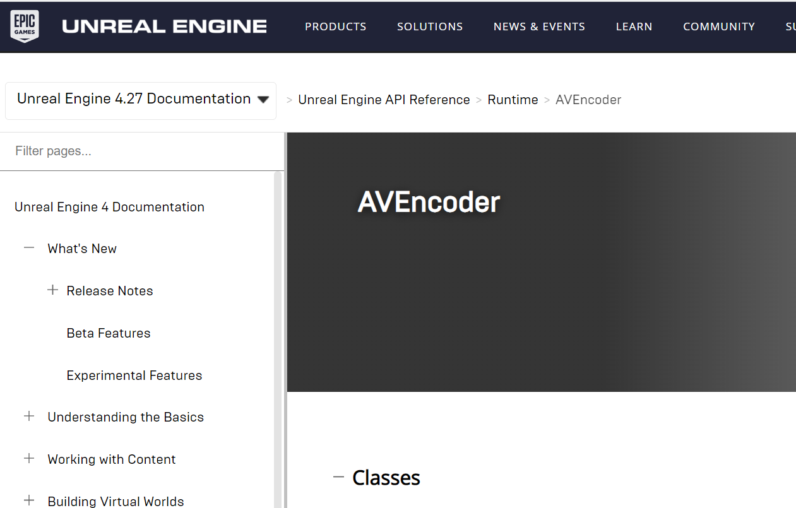
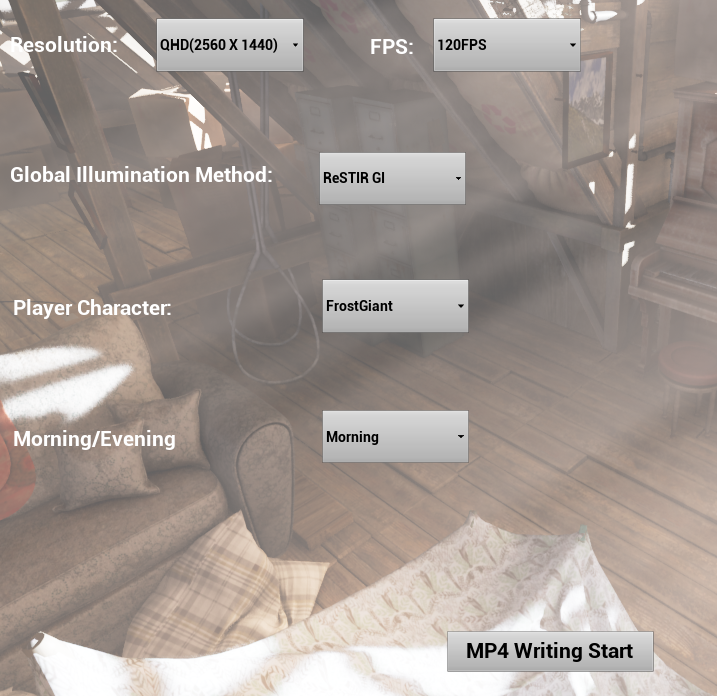

# 개요
- 경희소융 X 펄어비스 인재양성 프로그램에서 진행한 프로젝트
- 프로젝트 진행 기간: 2022년 10월 ~ 2023년 1월(4개월)
- 지도 교수님: 경희대학교 소프트웨어 융합학과 강형엽 교수님
- 진행 방식: 매 2주마다 교수님께 활동내역 보고 & 피드백
- 소개 영상: https://www.youtube.com/watch?v=Rxb3yeUVMB4

# 실행 방법
본 프로젝트는 NVidia 연구진들의 언리얼 레포지토리인  [NvRTX](https://github.com/NvRTX/UnrealEngine) 레포지토리를 개조하면서 진행했기 때문에  
별도로 언리얼 엔진을 빌드해야 실행할 수 있습니다.  
개조 언리얼 엔진 링크: https://github.com/yuntaewoong/UnrealEngine_NvRTX  

   
실행 과정
```
1. 위 레포지토리의 NvRTX_Caustics-4.26 branch코드로 언리얼 엔진빌드(Epic Games Organization가입 필요)
2. .uproject파일 우클릭 후 엔진 버전을 빌드한 엔진으로 선택
3. .sln 파일을 통해서 언리얼 프로젝트 빌드
4. .uproject 파일 실행 
```

# 프로젝트 소개

- 리플레이 동영상을 고퀄리티로 저장하는 언리얼 어플리케이션


- 리플레이 기록: 언리얼 리플레이 시스템 이용


- 리플레이의 고퀄리티 렌더링: ReSTIR GI논문 기술 이용(SPP:6, MaxBounce:64세팅) ,ReSTIR GI논문 기술은 NvRTX에 구현되어있음


- 고퀄리티 렌더링의 동영상 Encoding: 언리얼의 AVEncoder이용


- 리플레이 런타임 파라미터 조절(해상도,주사율,GI Method,캐릭터 Mesh, 시간대 커스터마이징)

# 최종 결과


# 참고 논문
- [ReSTIR](https://research.nvidia.com/sites/default/files/pubs/2020-07_Spatiotemporal-reservoir-resampling/ReSTIR.pdf)
- [ReSTIR GI](https://d1qx31qr3h6wln.cloudfront.net/publications/ReSTIR%20GI.pdf)


